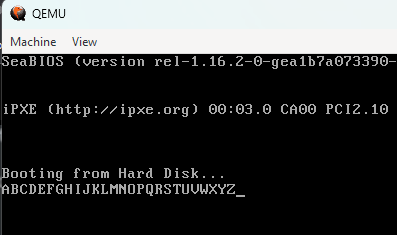

## 3. BIOS

> BIOS is a program that is made accessible to the microprocessor on an **erasable programmable read-only memory (EPROM)** chip. When you turn on your computer, the microprocessor passes control to the BIOS program, which is always located at the same place on EPROM.
>
> In this learning journey, I'll be following the tutorial by _**Daedalus Community**_ and not going for UEFI as it is more complicated.
>

### 3.1. Post Boot Sequence

> We now enter an `Operating Mode` called a "Real Mode", which is a 16-bit mode. This is the mode that the BIOS runs in.
>
> BIOS provides a host of "tools" for the user to interact with the OS. 
>
> Some examples are:
> - Displaying text on the screen
> - Reading input from the keyboard
> - Reading and writing to the disk, and so on.

### 3.2. BIOS Interrupts

> BIOS provides a set of **interrupts** that can be used to interact with the hardware. These interrupts are called **BIOS interrupts**.
>
> These interrupts are called by the `int` instruction. The `int` instruction takes a single argument, which is the interrupt number.
>
> For example, to print a character to the screen, we use the `int` instruction with the interrupt number `0x10`. In this case, it's a **Software Interrupt**.


## 4. Printing on Screen

> We can print text on the screen using the **BIOS interrupt** `0x10`.
>
> Also called the `Teletype Mode`, it is used to print a character to the screen. Here's how we switch to this mode:
> ```cpp
> mov ah, 0x0e
> mov al, 'H'
> int 0x10
> ```
> This is how each character can be printed. We can also print by using the Binary or the Hex value of the character. Loops are also valid.


## 5. Conditional Jumps/Loops

> Conditional Jumps in this context are being used to print multiple characters on the screen by taking advantage of loops.
>
> ```cpp
> mov ah, 0x0e
> mov al, 'A'
> int 0x10
> 
> label:
>     inc al
>     cmp al, 'Z'+1
>     je exit
>     int 0x10
>     jmp label
> exit:
>     jmp $
> ```
>
> The above code prints all the characters from `A` to `Z` as below:
> 

> For the challenge posed in the video, I've solved it using the code in <a href="/boot_alternateCAPletters.asm">this file.</a>
> 
> 

Continued in <a href="./strings.md">the next part</a>...