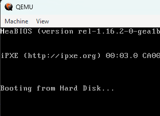

## 12. Protected Mode

> This is a `32-bit` mode that provides access to up to `4GB` of memory. But why are we switching to this mode ?
>
> - We can finally make use of all the `32-bit` registers and use `32-bit` instructions.
> - We also get access to features like `paging` and `multi-tasking`.
> - We can also *FINALLY* use `C/C++` code.

### 12.1. Entering Protected Mode

> First we need to define how segmentation will work after switching to protected mode. Every segment has a set of permissions and properties that should be set before we can use it.
>
> These properties are defined in what is called a **GDT** or `Global Descriptor Table`. This table is a list of segments that we can use. We can define up to `8192` segments in this table.
>
> To define each segment we also require a descriptor. It's a list of properties for that segment. A GDT also must contain the `code segment descriptor` and the `data segment descriptor`. These are the segments that will be used for code and data respectively.
>
> Coming to `Memory Models`, we have 3 types of memory models:
> - `Flat Model`: All segments are the same size and start at `0x0`.
> - `Segmented Model`: Segments can be of different sizes and start at different addresses.
> - `Paginated Model`: Segments are of the same size but can start at different addresses. This is the most common.
> 

### 12.2. Code Segment Descriptor

> The first thing that we need to define is the size and the memory location of the segment. The properties that we'll need to define it are `base` and `limit`.
>
> The `base` is the starting address of the segment and the `limit` is the size of the segment. The `limit` is a 20-bit value and the `base` is a 32-bit value. Usually, we'll set the `limit` to the maximum size possible, i.e, `0xFFFFF` and the `base` to `0x0`.
>
> Next, we'll need a few more properties. These are:
> - **`Present`** : This is a `1-bit` value that tells us if the segment is present in memory or not.
> - **`Privilege`** : This is a `2-bit` value that tells us the privilege level of the segment. This is used for `multi-tasking`. Highest privilege is `0` and lowest is `3`.
> - **`Type`** : This is set to `1` for code segments and `0` for data segments.
> - **`Flags`** : These are single bits that represent a boolean value. The first boolean property we look into are called `Type Flags`:
>   - **`Code`** : The first bit represents whether the property contains code. `1 _ _ _`
>   - **`Conforming`** : The second bit represents whether the code can be executed from a lower privilege level. We are setting this to zero as it is already has the highest privilege. `1 0 _ _`
>   - **`Readable`** : The third bit represents whether the code can be read. `1 0 1 _`
>   - **`Accessed`** : The fourth bit represents whether the code has been accessed. We set this to zero as it will be set to one when the code is accessed. `1 0 1 0`
>
> The next set of flags are called `Other Flags`:
> - **`Granularity`** : When this bit is set to `1`, the `limit` is multiplied by `0x1000`. This is a `1-bit` value that tells us whether the `limit` is in `bytes` or `4KB` pages. We set this to `1` as we want to use `4KB` pages. `1 _ _ _`
> - **`32-bits ?`** : This is a `1-bit` value that tells us whether the code is `16-bit` or `32-bit`. We set this to `1` as we want to use `32-bit` code. `1 1 _ _`
> - **`64-bits ?`** : This is a `1-bit` value that tells us whether the code is `32-bit` or `64-bit`. We set this to `0` as we want to use `32-bit` code. `1 1 0 _`
> - **`Available`** : This is a `1-bit` value that tells us whether the code is available for use. We set this to `0` as we want to use `32-bit` code. `1 1 0 0`
>
> Now, for the properties that are used to define the `Data Segment Descriptor`, all the above hold true except for the `Type Flags`. The `Type Flags` for the `Data Segment Descriptor` are:
> - **`Code`** : The first bit represents whether the property contains code. `0 _ _ 0`
> - **`Direction`** : The second bit represents whether the data segment grows up or down. We set this to `0` as we want the data segment to grow up. `0 0 _ 0`
> - **`Writable`** : The third bit represents whether the data can be written to (set it to 0 if it should be read-only). `0 0 1 0`

### 12.3. Creating the GDT

> Now that we know how to define the `Code Segment Descriptor` and the `Data Segment Descriptor`, we can create the `GDT`. The `GDT` is a list of segments that we can use.
> The code for the `GDT` can be found <a href="../gdt_protectedMode.asm">here</a>.

### 12.4. Loading the GDT

> Now that the `GDT` has been created, we can now switch to it.
>
> 1. Before this, we'll need to disable all interrupts. This is because we don't want any interrupts to occur while we are switching to protected mode.
> 2. This can be done by using the `cli` instruction. Then we'll need to load the `GDT` into the `GDTR` register. This can be done by using the `lgdt` instruction.
> 3. Then we'll need to set the last bit of the `CR0` register to `1`. 
The value of this register cannot be changed directly, hence we'll need to make use of a `General Purpose Register` to change it. Examples of a `General Purpose Register` are `eax`, `ebx`, `ecx`, `edx`, `esi`, `edi`, `ebp`, `esp`, where `e` stands for `extended`.
> 4. So we simply `mov` `CR0` to `eax`, perform a bitwise-or operation and `mov` it back to `CR0`.
> 5. Now we need to do what's called a `far jump`. This is a jump to a different segment. This can be done by using the `jmp` instruction. The `jmp` instruction takes in a `segment selector` and an `offset`. The `segment selector` is the index of the segment in the `GDT` and the `offset` is the address of the code that we want to jump to.
> 6. Now that we've switched to protected mode, we can finally use `32-bit` code. We can also use `C/C++` code.

&nbsp;
> ### Output of the code:
>
> 
> Notice the bright `H` on the top-left corner of the screen. This has been printed in the 32-bit mode, and not through BIOS.

Continued in <a href="./kernel.md">the next part</a>...