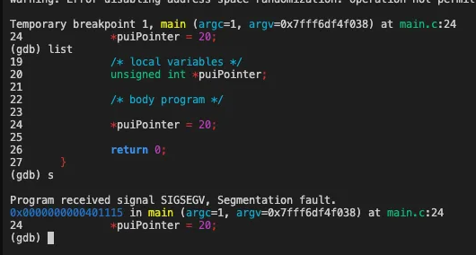

## 8. Stacks

> A stack is a data structure that holds a list of elements. The bottom of the stack is called the `base` and the top of the stack is called the `top`.
>
> It can do **two** operations. Each element is added to the top of the stack using a `push operation`.Each element is removed from the top of the stack using a `pop operation`. The stack is called a last-in-first-out **(LIFO)** data structure.
>
> When we `pop` a value from the top, we are removing that value from the top and assigning it to a `register`.
>
> For example:
> ```asm
> push 6
> pop ax
> ```
> 
> is the same as:
> 
> ```asm
> mov ax, 6
> ```

### 8.1. Using a Stack

> So how do we initialize a stack ?
>
> We can assign a pointer to the `base` of the stack (base pointer) and one to the `top` (stack pointer).
>
> Stacks are useful for storing temporary values, values that we may need to retrieve later on during the execution of a program.
>
> Two commonly used instructions are `pusha` and `popa`. They push and pop all the registers onto the stack, viz. `ax`, `bx`, `cx`, `dx`, `si`, `di`, `bp`, `sp`.
>

## 9. Functions

> Functions are a way to organize code into manageable chunks. They are also called `subroutines` or `procedures`.
>
> A few programs ago, we were using `jmp` to jump to a label. This is called an `unconditional jump`.
> 
> But now that we have a stack, we can substitute the `jmp` with a `call` instruction. This is called a `conditional jump`. And we can return to the original location using the `ret` instruction. In such a case, the *stack is handled automatically*.


## 10. Segmentation

> 
>
> If you've dabbled with C/C++, at some point you may have come across the `segmentation fault` error. Ever wondered what that was about? <br>
> This is because the program tried to access a memory location that it was not allowed to access.
>
> In **`Real Mode`**, we work with 16-bit addressing, meaning that there can be a maximum of 2<sup>16</sup> = 65536 memory locations, totalling a maximum of 64KiB of memory.
>
> Segmentation divides the memory into segments of 64KiB each so that we can reference a memory location using a segment and an offset.<br>
> We have Data Segment, Code Segment, Stack Segment and Extra Segment.
>
> Like we used `[org 0x7C00]` to set the origin of the code, it's the same as using `mov ds, 0x7C0`. Or when we used `mov al, [variable]` to dereference a variable, it's the same as using `mov al, [ds:variable]`.

&nbsp;
Continued in <a href="./readdisk.md">the next part</a>...