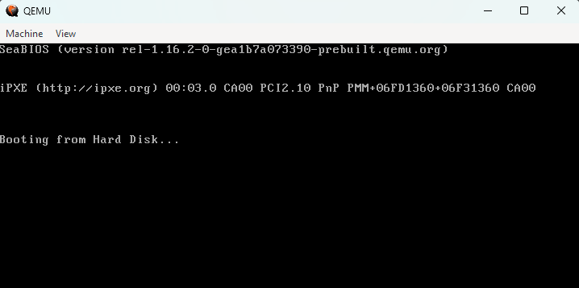

# Notes on Building and Running an OS
##### From: "Making an OS (x86)" by _**Daedalus Community**_ on [YouTube](https://www.youtube.com/watch?v=MwPjvJ9ulSc&list=PLm3B56ql_akNcvH8vvJRYOc7TbYhRs19M&ab_channel=DaedalusCommunity)

## 1. Startup/Boot

> BIOS (Basic Input/Output System) is the first thing that runs when the computer is turned on.
>
> But, how does it know where to look for the OS?
>
> The BIOS looks at the first `512 bytes of the hard drive` (the MBR, or Master Boot Record) for a special signature **(0xAA55)** that indicates that the MBR is bootable.
>
> These first 512 bytes of the MBR is called the Boot Sector, it's the first sector of a bootable drive. It ends with the hexadecimal signature *55* *AA*.
>

## 2. Making a Boot Sector

> **NOTE :** The whole binary file needs to be exactly 512 bytes long, to be recognized as bootable.
>
> Following code is defined in <a href="/learning-code/boot_sect_simple.asm">`boot_sect_simple.asm`</a> file.
>
> > `jmp $` : Jump to the current address, which is an infinite loop. 
> > `times 510-($-$$) db 0` : Fill the rest of the 512 bytes with zeros. 
> > `db 0x55, 0xaa` : The boot signature.
> 
> In Assembly, `db 0` means "define byte 0". Times refers to how many times the following instruction `510 - ($ - $$)` should be repeated. 
>
> The `$` symbol refers to the current address, and `$$` refers to the beginning of the file. 
>
> So, `510 - ($ - $$)` means "repeat the following instruction, (510 - (current address - beginning of file)) = (510-3) times". This will fill the rest of the file, after the JUMP statement with zeros.

> Now, we need to compile the assembly code into a binary file.
>
> Using NASM for Windows (I got it through winget package manager), we can compile the `.asm` file using the following command:
> > `nasm -f bin learning-code/boot_sect_simple.asm -o boot_simp.bin`
>
> This generates a binary file, exactly 512 bytes long.
>
> Now we can run this binary file using QEMU, a virtual machine.
>
> I installed QEMU using winget (I'm on Windows), and now we can run the binary file using the following command:
> > `qemu-system-x86_64 boot_simp.bin`
>
> This will run the binary file in a virtual machine, and we can see the output in the terminal.
>
> 

Continued in <a href="./bios.md">the next part</a>...