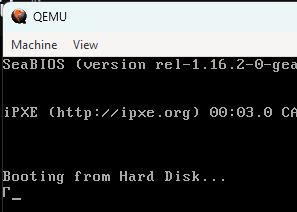
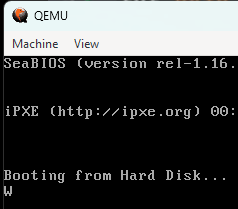
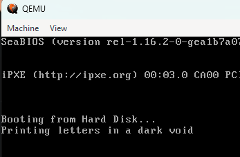
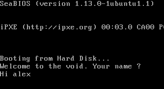

## 6. Strings

> We know how to use loops to print characters. That's how we print strings as well.
>
> We'll use a *pointer* to iterate through a string and use the **null character** to know when to stop.
>
> The null character is a character with the value 0. It's represented by `'\0'` in C.
>
> Now, we've used `db (define byte)` before to fill our boot sector with zeroes. We can use it to define strings as well.
>
> ```asm
>     db 5                ; Can defined a single number
>     db 1,2,3,4,5        ; Can define a list of numbers
>     db 'A'              ; Can define a single character
>     db "Hello World"    ; Can define a string
>     db "Hello", 'F', 2  ; Or we can mix and match
> ```
>
> In <a href="../strings.asm">this file</a>, I am printing a string on the screen.
> 
> Here a `variable` is created, by using `db` to define a string and add a null character to the end of it.
>
> Now, on line 4, we are loading a pointer of the `variable` into the AL register, so that we can iterate through the entire string.
>
> **NOTE :** However, there's an offset of `0x7c00` that is added to the pointer, which is the address of the boot sector in memory. This is because the boot sector is loaded at `0x7c00` in memory.
>
> **[INFO] :** BIOS has it's own <a href="https://en.wikipedia.org/wiki/Interrupt_vector_table">Interrupt Vector Table</a> which stores all the interrupt codes. These codes are loaded before the boot sector is loaded into memory.<br>
> As a result, and for satefy reasons, the origin of the boot sector is set to `0x7c00` in memory so that there are no collisions.
>
> The image below shows what is displayed on the screen when **NO** offset is added to the pointer.
>
> 
>
> And now we add the offset of `0x7c00` to the pointer.
>
> Similarly we can also set the offset of the pointer by using the `org` directive as `[org 0x7c00]`
>
> 
>
> Now, we can see that the first character of the string is printed on the screen. Now we use a loop to print the rest.
>
> The full code to display the text on the screen is given <a href="/printStr.asm">here</a> !!


## 7. Keyboard Inputs

> Just like we used a BIOS Interrupt `0x10` to print a character, we can use another BIOS Interrupt `0x16` to read a character from the keyboard.
> 
> The BIOS Interrupt `0x16` reads a character from the keyboard and stores the ASCII value in the `al` register, and a scan code in the `ah` register.
>
> Scan codes are used to identify which key was pressed. For example, the scan code for the `A` key is `0x1e`.
>
> Simple program below to only read and display characters from the keyboard is given <a href="/keyboardInp.asm">here</a>.
>
> 

&nbsp;
> Now, <a href="/input-store-print.asm">here's</a> a program that reads a string, stores it in a variable and then prints it on the screen. Along with some other text being displayed.
>
> 

&nbsp;
Continued in <a href="./stacks.md">the next part</a>...